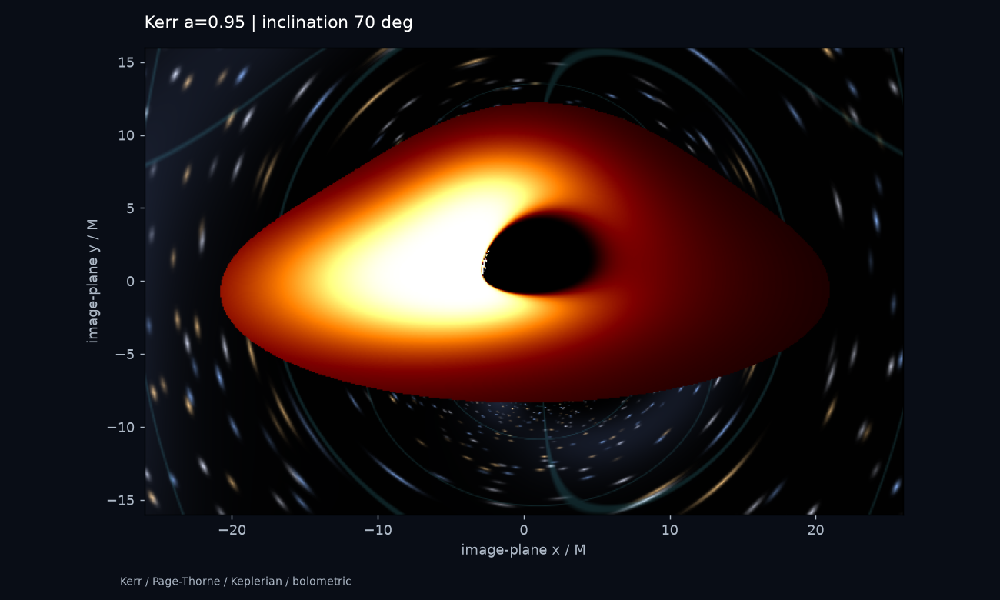
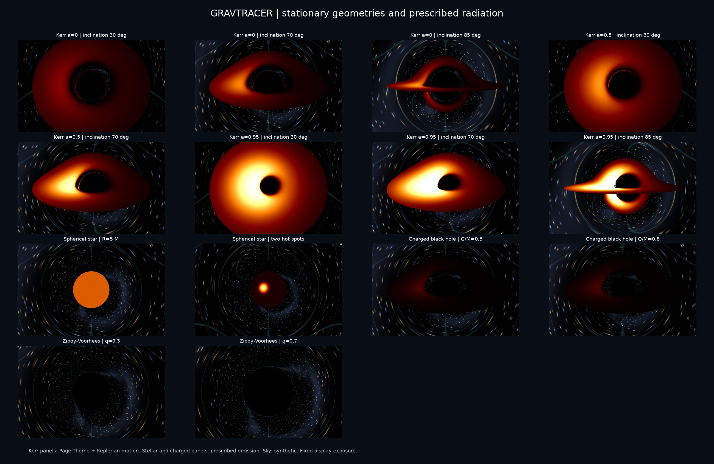

# GRAVTRACER

Fast, simple and reliable light tracer in curved spaces.

GRAVTRACER traces light around compact objects to render black-hole shadows,
accretion disks, lensing, stellar surfaces, and synthetic skies. A Fortran
geodesic core powers the Python package `grayt` and the `gravtracer` CLI.



*Kerr black hole, spin 0.95, viewed at 70°. The sky is synthetic and the colors
are a display mapping, not measured spectra.*

## Install

Requires Python 3.10+ and a Fortran compiler such as `gfortran`.

```sh
python -m pip install .
```

For development, install the build tools first, then use an editable install:

```sh
python -m pip install meson-python numpy ninja meson
python -m pip install -e . --no-build-isolation
```

Optional extras: `python -m pip install '.[viewer]'` for the OpenCL desktop
viewer, or `python -m pip install '.[interactive]'` for browser gallery tools.

## Quick start

```python
import grayt

black_hole = grayt.BlackHole(a=0.8)
camera = grayt.Camera(r=100, theta=70, resolution=(640, 400))
disk = grayt.PageThorneDisk(black_hole)
image = grayt.render_scene(
    black_hole, camera, disk,
    sky=grayt.CelestialSky.procedural(seed=42),
    exposure=5000,
)
image.plot()
image.save("observation.npz")
```

Camera angles are in degrees; `image.save` keeps raw ray and radiation maps
with scene provenance. For a command-line render:

```sh
gravtracer render configs/celestial_kerr.yml -o celestial.png --npz
```

## What it supports

- Kerr and Zipoy–Voorhees geometries, plus stationary axisymmetric metric
  tables and spherical stellar or charged exteriors.
- Thin disks, Page–Thorne disks, prescribed surfaces, gray volume radiation,
  and celestial image maps. The legacy thin-disk model reproduces the
  [OSIRIS paper](https://arxiv.org/abs/2202.00086).
- Double-precision CPU rendering; optional OpenCL rendering and a live
  desktop viewer for the supported Kerr and q-metric scenes.
- Scientific `.npz` archives, reproducible galleries, and camera movies.



*Model comparison with fixed display exposure. Charged and quadrupolar panels
are theoretical examples.*

Generate the gallery yourself with:

```sh
python examples/model_gallery.py --output output/stationary_models --skip-videos
```

See [custom models and scientific workflows](docs/custom_models.md) for model
assumptions, import formats, and gallery controls. The
[demo notebook](notebooks/grayt_demo.ipynb) provides a guided example.

## Validation and license

Install `.[test]`, then run `make test` for physics and regression checks.
OpenCL cases skip when no compatible device is available. See
[validation and paper errata](docs/validation.md) for reference results.
GRAVTRACER is released under the [MIT License](LICENSE).
