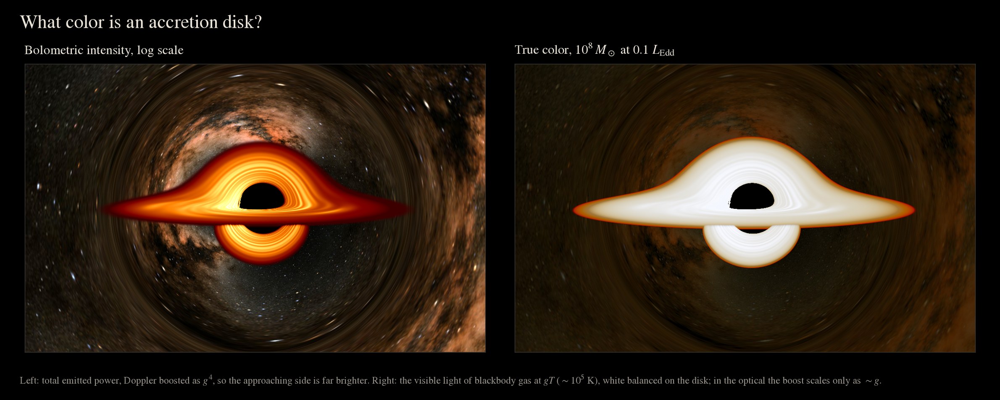
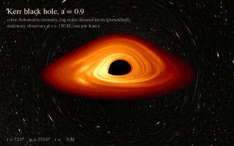
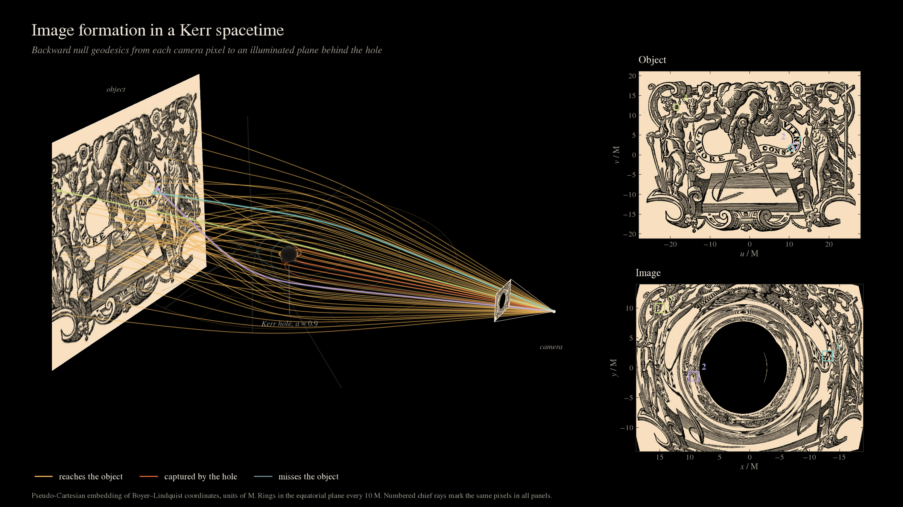
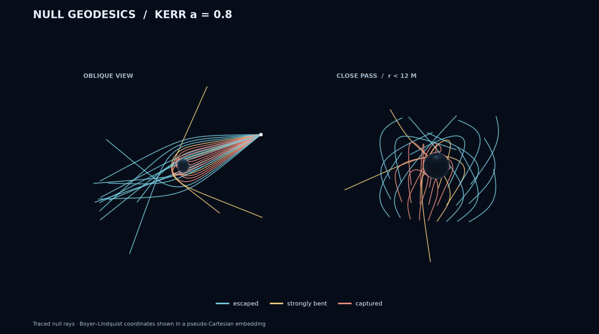

# GRAVTRACER

Fast, simple and reliable light tracer in curved spaces.

GRAVTRACER traces light around compact objects to render black-hole shadows,
accretion disks, lensing, stellar surfaces, and celestial skies. A Fortran
geodesic core powers the Python package `grayt` and the `gravtracer` CLI.


*Kerr black hole, spin 0.95, seen nearly edge-on (84°) from 150 M, the view
of [NASA SVS 13326](https://svs.gsfc.nasa.gov/13326/). The far side of the
thin disk is lensed over and under the shadow. The approaching side is
Doppler boosted, and the Milky Way behind is lensed around the hole. Color is
bolometric intensity on a log scale, as in EHT images, not true color. The
disk is a viscously spreading thin disk (Page–Thorne inside) with prescribed
sheared knots; the sky is [NASA SVS Deep Star Maps 2020](https://svs.gsfc.nasa.gov/4851/),
sampled along each ray's direction at infinity.*



*The same scene two ways. Total power is Doppler boosted as g⁴. The visible
light of gas at ~10⁵ K (a 10⁸ M☉ hole at 10% of Eddington, white balanced on
the disk) is nearly white, and its Doppler contrast is far weaker. `grayt.photometry`
renders the true-color version.*

## Install

Requires Python 3.10+ and a Fortran compiler such as `gfortran`.

```sh
python -m pip install .
```

For development, install the build tools first, then use an editable install:

```sh
python -m pip install meson-python numpy ninja meson
python -m pip install -e . --no-build-isolation
```

Install `python -m pip install '.[viewer]'` for the native OpenCL desktop viewer.

## Quick start

```python
import grayt

black_hole = grayt.BlackHole(a=0.8)
camera = grayt.Camera(r=100, theta=70, resolution=(640, 400))
disk = grayt.PageThorneDisk(black_hole)
image = grayt.render_scene(
    black_hole, camera, disk,
    sky=grayt.CelestialSky.nasa_starmap(),
    exposure=5000,
)
image.plot()
image.save("observation.npz")
```

Camera angles are in degrees; `image.save` keeps raw ray and radiation maps
with scene provenance. For a command-line render:

```sh
gravtracer render configs/celestial_kerr.yml -o celestial.png --npz
```

For a live desktop view, install the viewer extra and launch from the same
Python environment:

```sh
uv pip install '.[viewer]'
gravtracer view --gui-backend pyside6
```

Click **Settings** or press **H** to hide or show the parameter panel. Set
spin, observer position, view size, disk radius and angular momentum, then
click **Apply**. Choose a background image or the bundled NASA sky map and
adjust its rotation and brightness in the same panel. Sky images use an
equirectangular projection.

Drag to orbit and scroll to zoom. Moving previews use 512×256 rays; idle
images refine to 1024×512. Azimuth rotation reuses traced rays. **+ / −**
adjust display brightness, **B** changes the background, and **R** resets
the camera. To compare with the broad bright region in the first OSIRIS
panel, use `gravtracer view --spin 0 --l0 2.8 --gui-backend pyside6`.
See [viewer quality and paper comparisons](docs/viewer_quality.md) for details.

## What it supports

- Kerr and Zipoy–Voorhees geometries, plus stationary axisymmetric metric
  tables and spherical stellar or charged exteriors.
- Thin disks, Page–Thorne disks, gray slab disks of finite optical depth
  for optically thin emitters (transfer at every crossing), prescribed surfaces, gray volume radiation, and celestial
  image maps. The legacy thin-disk model reproduces the
  [OSIRIS paper](https://arxiv.org/abs/2202.00086).
- Double-precision CPU rendering; optional OpenCL rendering and a live
  desktop viewer for the supported Kerr and q-metric scenes.
- Scientific `.npz` archives, reproducible galleries, and camera movies.

## Gallery and ray paths


*Kerr holes arranged by spin and inclination, beside stellar, charged, and
Zipoy–Voorhees exteriors, all on one fixed log intensity scale, so brightness
compares across panels. Every observer looks toward the Milky Way's core, so
the bending of light shows in the distorted star field and its Einstein ring.*



*Kerr black hole, spin 0.9, seen by stationary observers at r = 150 M placed
all around it ([MP4](docs/animations/kerr_orbit.mp4)); each frame is one
observer at a later coordinate time, not a single moving camera. The view
starts over sparse sky, then the Milky Way sweeps in behind the hole and is
lensed around it. Knots in the disk are sheared by the Keplerian flow, with
light-travel delays; they are prescribed, not MHD. The color scale is the one
used above. Made with `python examples/kerr_movie.py`.*



*How an image forms. Each camera pixel sends a null geodesic backward until it
meets the illuminated card, falls into the hole, or escapes. Rays 1 and 2 land
on almost the same point of the engraving but pass on opposite sides of the
hole: they are its primary and secondary images. Run
`python examples/image_formation_scene.py` to reproduce it.*



*The same traced null rays from two angles. Colors distinguish escaped,
strongly bent, and captured rays. Positions use a pseudo-Cartesian embedding
of Boyer–Lindquist coordinates.*

Generate the gallery yourself with:

```sh
python examples/model_gallery.py --output output/stationary_models --skip-videos
```

`grayt.photometry` renders scenes on an absolute scale: blackbody emission
at the redshifted temperature, a calibrated sky, CIE colors, and one global
tone curve (`render_scene(..., photometry=grayt.photometry.Photometry(...))`).

Every figure uses one house style: a black field and STIX serif type. Library
plots apply it automatically; call `grayt.style.use()` to style your own
matplotlib figures the same way.

See [custom models and scientific workflows](docs/custom_models.md) for model
assumptions, import formats, and gallery controls. The
[demo notebook](notebooks/grayt_demo.ipynb) provides a guided example.

## Validation and license

Install `.[test]`, then run `make test` for physics and regression checks.
OpenCL cases skip when no compatible device is available. See
[validation and paper errata](docs/validation.md) for reference results.
GRAVTRACER is released under the [MIT License](LICENSE).
